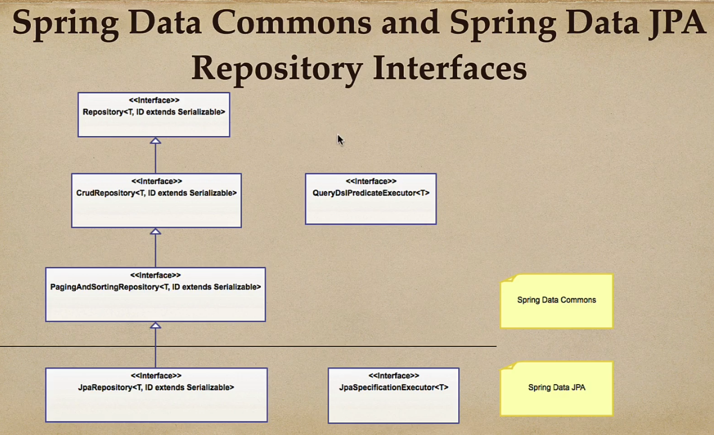
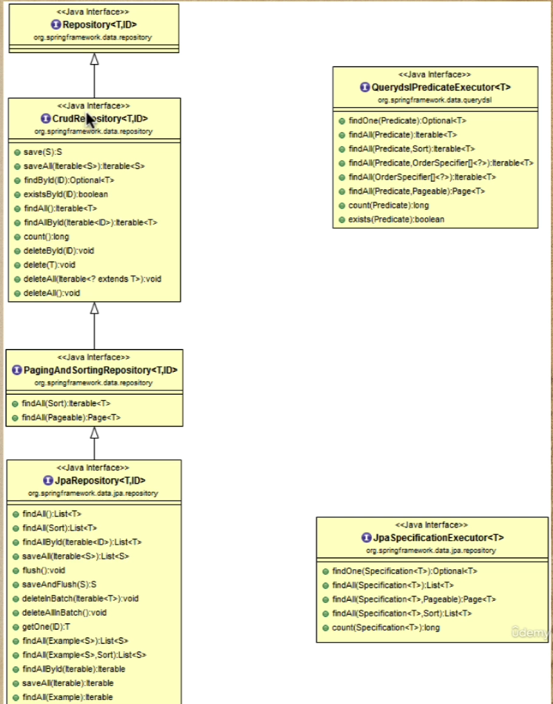
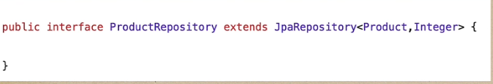
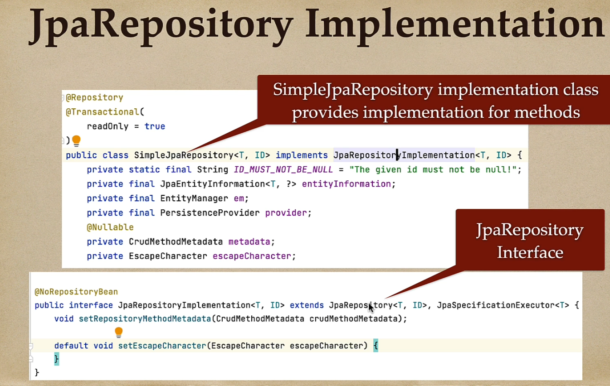
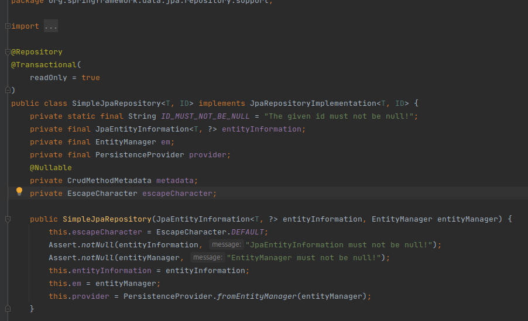

## Spring Data JPA

### Spring Data
Spring Data Commons is the super class from which many others derive.

Spring Data JPA, Spring Data MongoDB, Spring Data JDBC, all derive from Spring Data Commons.

The focus of this course is Spring Data JPA.

Check below the class diagram:

And more, for the JpaRepository relations:

Once we do as below:

We have access to all the methods from all shown interfaces.

### Where is the implementation?

Spring Data JPA is the one that implements all of the methods. 

It is dealt with in the SimpleJpaRepositoy class.

As below:

All the methods in the SimpleJpaRepositoy class are @Transactional.

### Class location
The file "SimpleJpaRepository.class" is in the support directory, under External Files of spring-data-jpa library.

There we see a class that implements the JpaRepositoryImplementation interface (which implemented JpaRepository interface).

## Query methods

### Rules to create a query method:

1. The name of our query must start with one of the following:

* find...By
* read...By
* query...By
* count...By
* get...By

Examples: findByName, readByName, queryByName, getByName

2. If we want ot limit the number of returned query results, 
we can add the first or the top keyword before the first by word.
 
Examples: findFirstByName, readFirst2ByName, findTop10ByName

3. If you want to select unique results, you have to add the Distinct
keyword before the fist By word.

Example: findDistinctByName or findNameDistinctBy

4. Combine property expressions with AND and OR keywords.
Examples: findByNameOrDescription, findByNameAndDescription

### Returning Values form Query Methods

They can return one result or more than one result.

1. If we are writing a query that should return only one result, we can resturn the following types:

* Basic type: it will return the found basic type or null.
* Entity: it will return an entity object or null.
* Guava/Java 8 Optional<T>: it will return an Optional that contains the found object or an empty Optional.

2. If we are writing a query method that should return more than one result, we can return the following types:

* List<T>: it will return a lista that containes the query results or an empty list.
* Stream<T>: it will return a Stream that can be used to access the query results or an empty Stream.

Checar docs.spring.io documentation for the available keywords and modifiers -- as well as return types.
